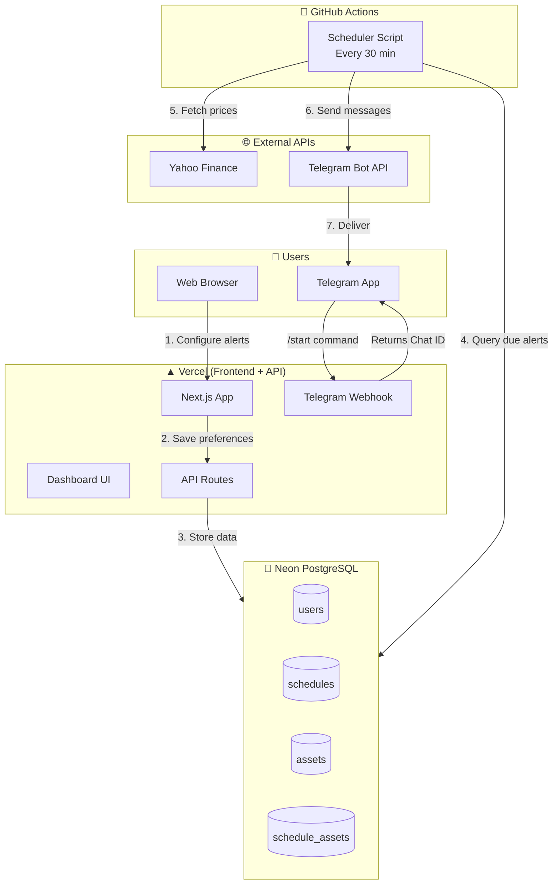

# 🕉️ LaughingBuddha Architecture Guide

## Overview
A **multi-user SaaS stock alert platform** using Neon PostgreSQL + GitHub Actions + Vercel + Telegram.

> **Previous Version:** Simple single-user bot (see git history)
> **Current Version:** Multi-user scheduled alerts with per-user timezones and custom asset lists

---

## 🏗️ Architecture Diagram



---

## 💰 Cost Breakdown (100% Free)

| Component | Tool | Cost | Limits |
|-----------|------|------|--------|
| **Database** | Neon PostgreSQL | $0 | 500 MB storage, 190 compute hours/month |
| **Automation** | GitHub Actions | $0 | Unlimited for public repos |
| **Hosting** | Vercel | $0 | 100GB bandwidth/month |
| **Data** | Yahoo Finance | $0 | Unofficial API (fair use) |
| **Messaging** | Telegram Bot API | $0 | 30 messages/second |
| **Auth** | Clerk | $0 | 5,000 monthly active users |

---

## 📊 Database Schema

### Key Tables

| Table | Purpose |
|-------|---------|
| `users` | Store user profiles, telegram_chat_id, timezone |
| `assets` | Assets each user wants to track |
| `schedules` | Time-based alert configurations |
| `schedule_assets` | Junction table linking schedules to assets |

### User Flow

1. User signs up (Clerk auth)
2. User messages `/start` to Telegram bot → gets Chat ID
3. User enters Chat ID on website → linked
4. User creates schedule (time + assets + days of week)
5. GitHub Actions queries DB every 30 min
6. Due schedules trigger price fetch + Telegram message

---

## ⏰ Cron Schedule

GitHub Actions runs **every 30 minutes** to check for due alerts:

```yaml
schedule:
  - cron: '0,30 * * * *'  # Every 30 minutes
```

The script queries: "Which users have target_time matching current time in their timezone?"

---

## 🔐 Environment Variables

### Vercel (Frontend + API)
```
DATABASE_URL=postgresql://... (Neon connection string)
TELEGRAM_BOT_TOKEN=your-bot-token
NEXT_PUBLIC_CLERK_PUBLISHABLE_KEY=pk_...
CLERK_SECRET_KEY=sk_...
```

### GitHub Actions Secrets
```
DATABASE_URL=postgresql://... (same as Vercel)
TELEGRAM_BOT_TOKEN=your-bot-token
```

---

## 🚀 Deployment

### Phase 1: Database
```bash
npx prisma migrate dev --name add_schedules
```

### Phase 2: Deploy
1. Push to GitHub → Vercel auto-deploys
2. Set environment variables in Vercel dashboard
3. Set secrets in GitHub repository settings
4. Set Telegram webhook:
```bash
curl -X POST "https://api.telegram.org/bot<TOKEN>/setWebhook" \
  -d '{"url": "https://your-app.vercel.app/api/telegram/webhook"}'
```

---

## 📁 Project Structure

```
laughingbuddha/
├── .github/workflows/
│   └── main.yml          # GitHub Actions scheduler
├── app/
│   ├── api/
│   │   ├── schedules/    # CRUD for schedules
│   │   ├── telegram/webhook/  # Telegram bot handler
│   │   └── users/        # User preferences
│   └── dashboard/        # User dashboard
├── prisma/
│   └── schema.prisma     # Database schema
├── scripts/
│   └── scheduler.py      # GitHub Actions script
└── plans/
    ├── multi-user-architecture.md
    └── implementation-guide.md
```

---

## 📚 Documentation

- [`plans/multi-user-architecture.md`](plans/multi-user-architecture.md) - Full system design
- [`plans/implementation-guide.md`](plans/implementation-guide.md) - Step-by-step implementation

---

*May your portfolio always be green! 📈🕉️*
