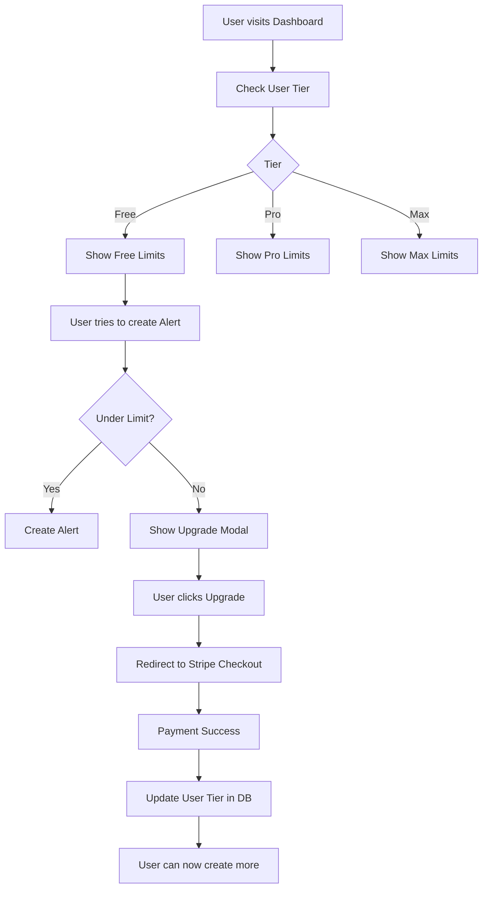

# Subscription Plans Implementation Plan

## Overview
Implement three paid subscription tiers (Free, Pro, Max) in the Laughing Buddha dashboard with tier-based feature limits and Stripe integration for payments.

---

## Current State
- **Database**: Already has `Tier` enum with `FREE` and `PRO`
- **User Model**: Has `tier` field on User model
- **Profile Page**: Shows tier in dashboard/profile

---

## Plan

### Phase 1: Database Schema Updates

1. **Add MAX tier to enum**
   ```prisma
   enum Tier {
     FREE
     PRO
     MAX
   }
   ```

2. **Add subscription fields to User model**
   ```prisma
   model User {
     // ... existing fields
     stripeCustomerId    String?   @map("stripe_customer_id")
     subscriptionId      String?   @map("subscription_id")
     subscriptionStatus  String?   @map("subscription_status") // active, canceled, past_due
     subscriptionPlan    Tier      @default(FREE)
     planExpiresAt       DateTime? @map("plan_expires_at")
   }
   ```

3. **Add tier limits configuration**
   ```typescript
   // lib/subscription-limits.ts
   export const TIER_LIMITS = {
     FREE: {
       maxAlerts: 3,
       maxAssets: 5,
       maxSchedules: 1,
       priceAlerts: true,
       scheduledAlerts: false,
       telegram: true,
       whatsapp: false,
       emailSupport: true,
       prioritySupport: false,
     },
     PRO: {
       maxAlerts: 20,
       maxAssets: 25,
       maxSchedules: 5,
       priceAlerts: true,
       scheduledAlerts: true,
       telegram: true,
       whatsapp: true,
       emailSupport: true,
       prioritySupport: false,
     },
     MAX: {
       maxAlerts: -1, // unlimited
       maxAssets: -1,
       maxSchedules: -1,
       priceAlerts: true,
       scheduledAlerts: true,
       telegram: true,
       whatsapp: true,
       emailSupport: true,
       prioritySupport: true,
     },
   };
   ```

---

### Phase 2: Backend API

1. **Create subscription API routes**
   - `app/api/subscription/plan/route.ts` - Get current plan details
   - `app/api/subscription/checkout/route.ts` - Create Stripe checkout session
   - `app/api/subscription/portal/route.ts` - Create Stripe customer portal session
   - `app/api/subscription/webhook/route.ts` - Handle Stripe webhooks

2. **Update user API to include tier limits**
   - Modify `app/api/users/me/route.ts` to return tier limits with user data

3. **Add usage tracking helpers**
   - `lib/subscription-usage.ts` - Check current usage against limits

---

### Phase 3: Frontend Components

1. **Create pricing/plans page**
   - `app/dashboard/plans/page.tsx` - Display Free, Pro, Max plans
   - Show current plan highlighted
   - Upgrade/downgrade buttons

2. **Update profile page**
   - Show current plan badge
   - Link to plans page for upgrade

3. **Add upgrade prompts**
   - Show upgrade modal when user hits limit
   - Block feature usage and show upgrade CTA

4. **Create subscription management component**
   - `components/subscription/plan-card.tsx` - Individual plan display
   - `components/subscription/usage-meter.tsx` - Show current usage
   - `components/subscription/upgrade-modal.tsx` - Upgrade prompt

---

### Phase 4: Stripe Integration

1. **Set up Stripe products**
   - Pro: $9.99/month
   - Max: $24.99/month

2. **Create webhook handler**
   - Handle `checkout.session.completed`
   - Handle `customer.subscription.updated`
   - Handle `customer.subscription.deleted`

3. **Create checkout flow**
   - Redirect to Stripe Checkout
   - Handle success/cancel redirects

---

### Phase 5: Feature Gating

1. **Add limit checks before operations**
   - Check alert limit before creating alert
   - Check asset limit before adding to portfolio
   - Check schedule limit before creating schedule

2. **Add visual indicators**
   - Show usage meter in sidebar
   - Display "Pro" / "Max" badges on UI

---

## API Structure

```
/api/subscription/
├── plan/GET           # Get current plan details
├── checkout/POST      # Create checkout session
├── portal/POST        # Create customer portal session
└── webhook/POST       # Stripe webhook handler
```

---

## File Changes Summary

| File | Action |
|------|--------|
| `prisma/schema.prisma` | Add MAX tier, subscription fields |
| `lib/subscription-limits.ts` | Create tier limits config |
| `lib/subscription-usage.ts` | Create usage tracking helpers |
| `app/api/subscription/plan/route.ts` | Create plan API |
| `app/api/subscription/checkout/route.ts` | Create checkout API |
| `app/api/subscription/portal/route.ts` | Create portal API |
| `app/api/subscription/webhook/route.ts` | Create webhook API |
| `app/api/users/me/route.ts` | Add tier limits to response |
| `app/dashboard/plans/page.tsx` | Create plans page |
| `app/dashboard/profile/page.tsx` | Update with plan info |
| `components/subscription/*.tsx` | Create subscription components |
| `middleware.ts` | Protect subscription routes |

---

## Mermaid: Subscription Flow



---

## Implementation Order

1. Update Prisma schema with MAX tier
2. Create subscription limits config
3. Create usage tracking helpers
4. Create subscription API routes
5. Update users/me API
6. Create plans page UI
7. Update profile page
8. Add feature gating
9. Set up Stripe (products, webhook)
10. Test full flow
